# FAQ
## 修改参数及代码实现aipp融合算子
### aipp+small_channel
* 写在前面
在YoloV5  6.0及以上版本，模型计算图有首层卷积
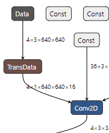
此时增加aipp才能与首层卷积融合，才有意义，aipp算子着眼于提高模型性能，经过测试，YoloV5m 6.0版本模型在增加了aipp算子后，性能提高了约4％
* 具体步骤：
1. atc转模型时增加如下参数：
（在onnx2om.sh脚本里寻找）
	a. 去掉“--input_fp16_nodes”参数
	b. 加上“--insert_op_conf=aipp.cfg”参数
	c. 加上“--enable_small_channel=1”参数

2. aipp.cfg：参照博客中原文
http://3ms.huawei.com/km/blogs/details/13533061

3. 更改common/util/model.py下的代码

更改前：

    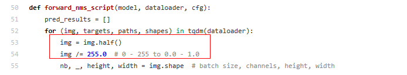
    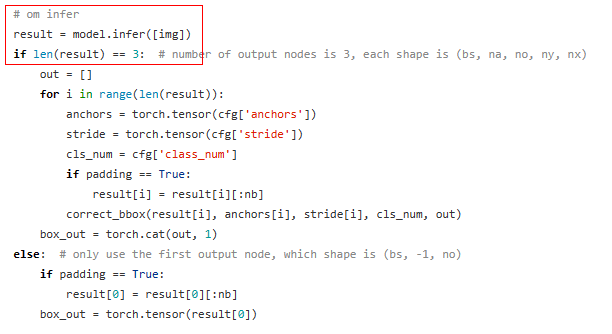

更改后: 

    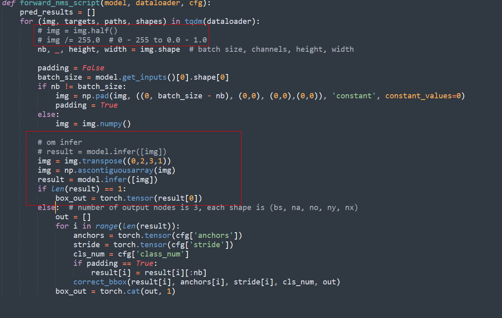

p.s. 建议将原函数注释，复制一份重写，方便随时替换

4. 修改model.yaml
conf_thres: 0.001  # object confidence threshold, conf>0.1 for nms_op
iou_thres: 0.6  # IOU threshold for NMS
  - 说明
	- conf_thres为置信度，设置的越小，生成的预选框就越多，精度越高，性能越差
	- iou_thres为交并比（交集比并集），直接参与nms的计算，参与预选框的选择与删除

    
## yolov5训练时出现_pickle.UnpicklingError: STACK_GLOBAL requires str的解决办法
参照博客
https://blog.csdn.net/weixin_44358914/article/details/120247850

## 转onnx报错
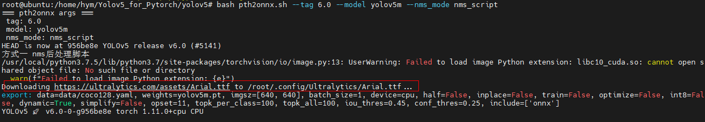  

如不能自动下载，仅需要按照提示点击链接下载字体文件并放到对应位置即可

## 计算图size与实际输入size无法对齐报错
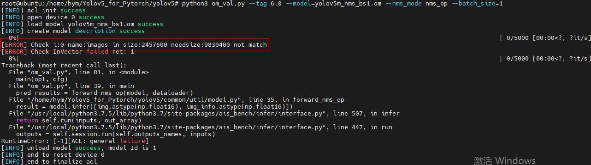
图示为：输入数据的size与计算图实际要求size不一致导致无法传入数据。具体原因有以下3种：
1. 图片size没有对齐，我们modelzoo仓里的YOLOV5适配的是640*640的模型，因为传入的图片经由om_val生成的数据的size是640*640的，如果客户模型为1280*1280或下载的权重为1280*1280，则无法确保能够直接跑通。
2. 图片batch_size没有对齐，如果你选择将shell脚本中的命令提取出来单独执行，首先你需要注意命令的先后顺序，不错写漏写命令，其次命令中的参数需要你手动输入，nms_script和nms_op方式的onnx2om命令是有区别的，不要通过上下键使用历史命令，请从onns2om.sh中重新复制并进行相应修改，如下图（* 注意：只有当你选择nms_op方式时，才需要考虑此条。）
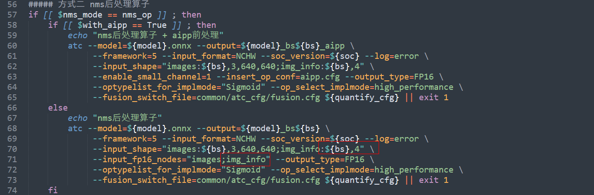
3. 数据类型没有对齐，也是最常见的问题，使用onnx2om.sh脚本转出的om输入节点dtype为fp16，所以数据预处理阶段也需要处理为fp16；加入aipp后，om输入节点dtype变为uint8，所以数据预处理节点需要处理为uint8即可。
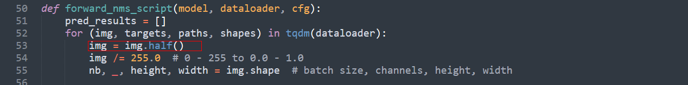

## arm安装onnxsimplifier失败
请参考链接：http://3ms.huawei.com/km/blogs/details/13673985

## 模型量化失败
AMCT报错（由于量化为具体客户需求，一般情况不需要量化，量化会使模型精度下降，性能提高）
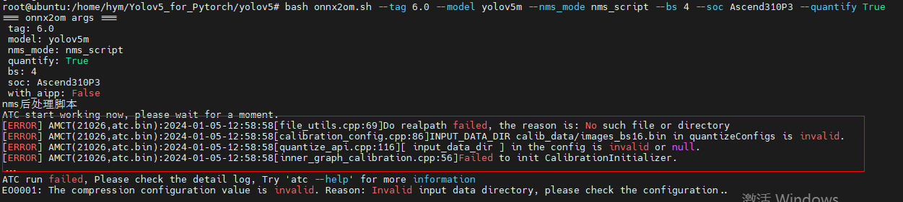

详细解决步骤为：首先运行common/quantify/gen_calib_data.py
```
python common/quantify/gen_calib_data.py
```
会在yolov5文件夹下生成calib_data文件夹，文件夹内包含俩个文件：images_bs16.bin、img_info_bs16.bin

## 转om报错
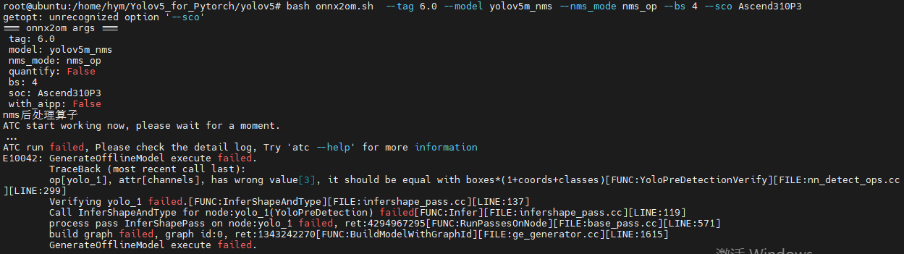
图示报错信息显示的是yolopredetectionVerify算子中维度没有对齐的问题，这里提供一种可能导致报错的原因，由于第一步pth2onnx.sh脚本中有打patch的操作，有些同学在容器中执行该脚本时，由于没有配备git命令（或各种原因），导致没有打上patch，script模式下patch是否打上无可厚非，但是op模式下必须打上patch，不然就会报图示错误，具体缺少git命令而没有打上patch显示如下
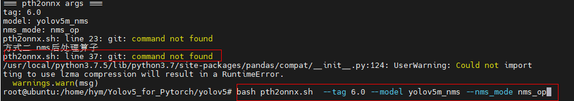
如果该方法没能解决上述问题，那么请参考原看护人所写博客中解决该问题的方法。

## 推理报错

torch更新为1.10.1，torchvision更新为0.11.2，即可解决报错

## om_val计算精度报错
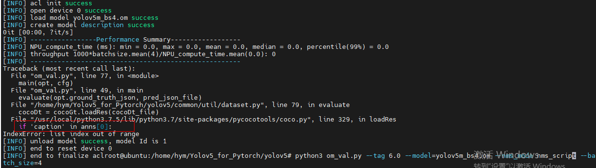
模型评估阶段，数据类型不匹配，可根据
https://blog.csdn.net/IcdKnight/article/details/113780911
对源码进行修改。

## 预处理阶段报错
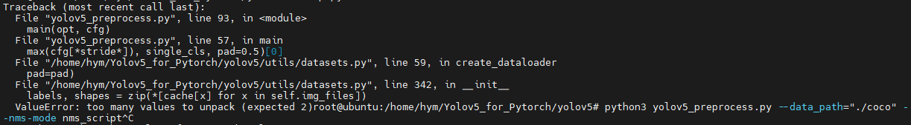
如图示报错，删除coco文件夹下生成的.cache文件即可解决

## 精度比对工具报错
首先msquickcmp精度比对工具目前不支持传入默认数据进行动态bs的onnx与om比对，需要手动构造随机输入传入，然后可能会报如下错误
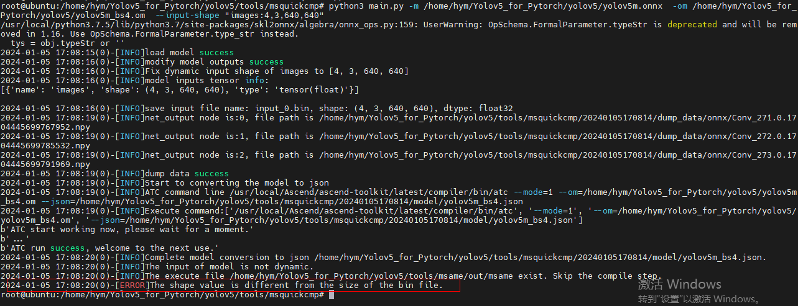
由于msquickcmp工具的npu_dump_data.py脚本会对输入数据size进行强校验，俩种方式可以解决报错，①将onnx改为静态②注释下图红框中的代码
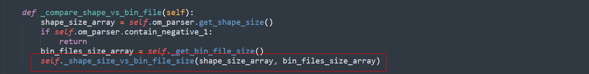
需要注意的是，由于转om的脚本中设置了输出节点dtype为fp16，而onnx输出节点为fp32，所以需要将输出节点dtype设置成一致，将onnx2om.sh脚本中的该段注释，即可进行正确的精度比对
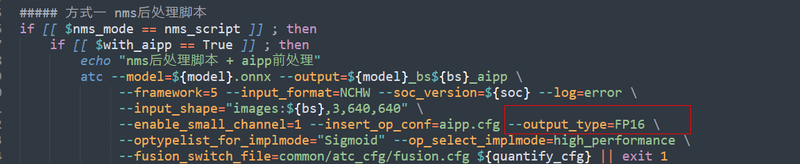


# 诉求
## 多卡推理
由于原om_val.py脚本调用的是acl接口实现的离线推理，无法直接使用现ais_bench所具备的多卡推理的功能，目前拆分出的三段式推理可以将预处理输出的二进制数据集送入ais_bench工具。p.s.现ais_bench工具也支持多进程推理，自助下载链接[ais_bench](https://gitee.com/ascend/tools/tree/master/ais-bench_workload/tool/ais_bench).

## 使用客户数据集单张图片推理验证
om_val.py脚本是具备单张图片推理功能的，由于脚本中写死的数据集路径，你需要按照README中coco2017数据集的格式修订你需要处理的客户数据集的格式，修改为
```
coco(此处名字随便取)
   ├── val2017(此处名字不能变)
      ├── 00000000139.jpg(这里放你需要进行推理的单张图片)
   └── val2017.txt(该txt文件中写入你所要处理图片的绝对路径)
```
然后需要对om_val.py脚本作出一些修改，未标记* 符号的步骤都需要操作
1）将最后调用Pycocotools输出精度的部分注释，如下
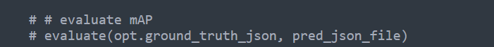
* 注意：此处只是不计算最后的mAP即平均精度，每一张图片的置信度仍保留。

2）在实际通过命令调用om_val脚本时，需要加入--data_path参数，即
```
python3 om_val.py --tag 6.1 --model=yolov5s_bs4.om --nms_mode nms_script --batch_size=4 --data_path=${填入上文中你创建的数据集的绝对路径}
```

*3）根据实际诉求，如果需要画框的话，om_val.py脚本运行完后，会生成以模型名字+_predictions.json命名的推理结果json文件，其内容如下
```
图片ID：（）， 所属类别：（），框的坐标：[左上角点的横坐标，左上角点的纵坐标，框的宽，框的高]，置信度：（）
{"image_id": "test", "category_id": 1, "bbox": [97.4, 10.4, 684.4, 729.6], "score": 0.97363}
```
json文件中用列表以字典的形式保存了所有图片所有检测出的物体的信息，所以可以通过类似如下方式进行信息的选取，并画框
```
import cv2
for i in pred_results:
   bbox = list(map(int, i['bbox']))
   src = cv2.imread(opt.data_path + "val2017/" + i['image_id'] + '.jpg')
   dst = cv2.rectangle(src, bbox[:2], [bbox[0]+bbox[2]/2, bbox[1]+bbox[3]/2], (150,150,150))
   cv2.imshow("dst", dst) #这里可以改成imwrite
   cv2.waitKey(0)
```