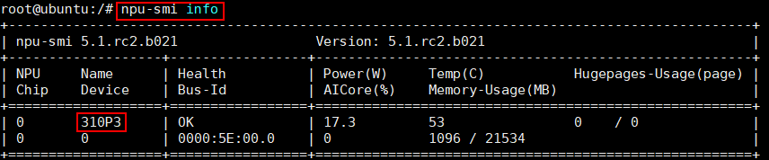

# Yolov5模型推理
---


## 文件说明
```
Yolov5_for_Pytorch
└── common
  ├── pth2om.sh            pth导出om模型
  ├── om_infer.py          推理导出的om模型
  └── util           pth导出om相关脚本
    ├── acl_net.py         PyACL接口
    ├── atc.sh             atc转模型脚本
    └── modify_model.py    onnx模型修改，添加NMS后处理
  └── quantize       量化相关脚本
    ├── generate_data.py   生成量化校准数据
    ├── img_info_amct.txt  用于量化校准的图片信息
    └── amct.sh            onnx模型量化
└── 2.0 / 3.1 / 4.0 / 5.0 / 6.0 / 6.1 
  ├── xx.patch             对应版本的修改patch
  └── run.sh               推理Demo
```

## 一、环境准备

### 1.1 下载pytorch源码，切换到对应分支
```shell
git clone https://github.com/ultralytics/yolov5.git
git checkout v2.0/v3.1/v4.0/v5.0/v6.0/v6.1
```

### 1.2 准备以下文件，放到pytorch源码根目录
（1）common文件夹及对应版本文件夹  
（2）对应版本的 [权重文件](https://github.com/ultralytics/yolov5/tags)  
（3）coco2017数据集val2017和label文件**instances_val2017.json**  
（4）[可选] 若需评估性能，下载benchmark工具，不同平台下载路径 [x86](https://support.huawei.com/enterprise/zh/software/255327333-ESW2000481524) / [arm](https://support.huawei.com/enterprise/zh/software/255327333-ESW2000481500)

### 1.3 安装依赖
非强制安装，若存在版本相关问题，可参考[requirements.txt](requirements.txt)的版本信息装包。
```shell
pip install -r requirements.txt
```


## 二、推理步骤

### 2.1 设置环境变量
根据实际安装的CANN包路径修改`/usr/local/Ascend/ascend-toolkit`。
```shell
source /usr/local/Ascend/ascend-toolkit/set_env.sh
```

### 2.2 pt导出om模型
运行`pth2om.sh`导出om模型，默认保存在`output`路径下，可通过`bash common/pth2om.sh -h`查看完整参数设置。
```shell
bash common/pth2om.sh --version 6.1 --model yolov5s --bs 4 --soc Ascend310P3
```
其中，soc为必选参数，通过`npu-smi info`命令查看。


### 2.3 om模型推理
运行`om_infer.py`推理om模型，结果默认保存在`output/predictions.json`，可设置参数`--eval`计算`mAP`，`--visible`将检测结果显示到图片。
```shell
python3 common/om_infer.py --img-path=./val2017 --model=output/yolov5s_nms_bs4.om --batch-size=4 --eval
```


## 三、端到端推理Demo
对应版本文件夹下提供`run.sh`，作为实现端到端推理的样例参考，默认参数设置见`run.sh`。参数详情可通过`bash common/pth2om.sh -h`和`bash common/eval.sh -h`查看。
```shell
source /usr/local/Ascend/ascend-toolkit/set_env.sh
bash v6.1/run.sh Ascend310P3 6.1 yolov5s 4 fp16
```


## 四、量化（可选）
安装 [量化工具](https://www.hiascend.com/document/detail/zh/CANNCommunityEdition/51RC2alpha005/developmenttools/devtool/atlasamctonnx_16_0011.html) 和 [onnx改图接口工具](https://gitee.com/peng-ao/om_gener) ，执行以下脚本导出om量化模型。
```shell
bash common/pth2om.sh --version 6.1 --model yolov5s --bs 4 --type int8 --calib_bs 16 --soc Ascend310P3
```
说明：  
（1）量化存在精度误差，可使用实际数据集进行校准以减少精度损失。若用自己的数据集训练，要修改[img_info_amct.txt](common/quantize/img_info_amct.txt) 文件中的校准数据。  
（2）设置参数`--type int8 --calib_bs 16`可生成om量化模型，其中16为量化使用的校准数据个数，根据实际所用的校准数据修改。  


## FAQ
常见问题可参考 [FAQ](FAQ.md)

